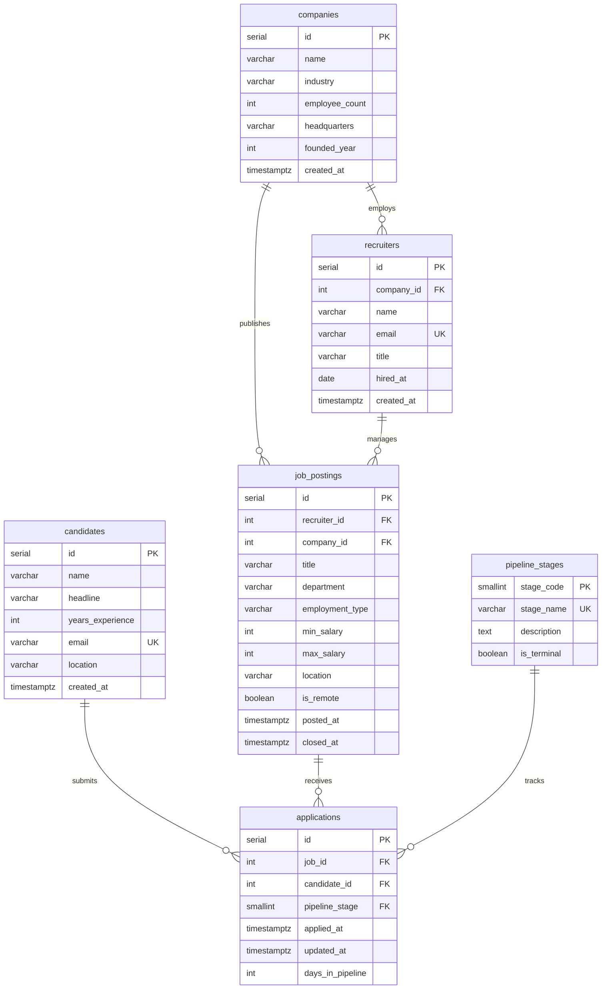

# Entity-Relationship Diagram

## Overview

The LinkedIn Hiring Patterns Database models the recruitment lifecycle from corporate accounts through application conversion.

## Cardinality Summary

| From | To | Cardinality | Description |
|------|----|-------------|-------------|
| `companies` | `recruiters` | 1:N | One company employs many recruiters |
| `companies` | `job_postings` | 1:N | One company publishes many roles |
| `recruiters` | `job_postings` | 1:N | One recruiter manages many listings |
| `candidates` | `applications` | 1:N | One candidate submits many applications |
| `job_postings` | `applications` | 1:N | One job receives many applications |
| `candidates` ↔ `job_postings` | via `applications` | N:M | Junction resolves many-to-many |

## Views

| View | Purpose |
|------|---------|
| `v_application_pipeline` | Denormalized application lifecycle for dashboards |
| `v_job_posting_summary` | Per-role funnel metrics and salary midpoint |
| `v_company_hiring_metrics` | Company-level hiring volume and benchmarks |

## Seed Data Patterns

The seed dataset intentionally validates:

1. **Job 1 → 4 applicants** — one posting, many candidates (1:N from job side)
2. **Priya → 3 applications** — one candidate, many jobs (1:N from candidate side)
3. **Elena → 2 Databricks roles** — cross-listing within the same company
